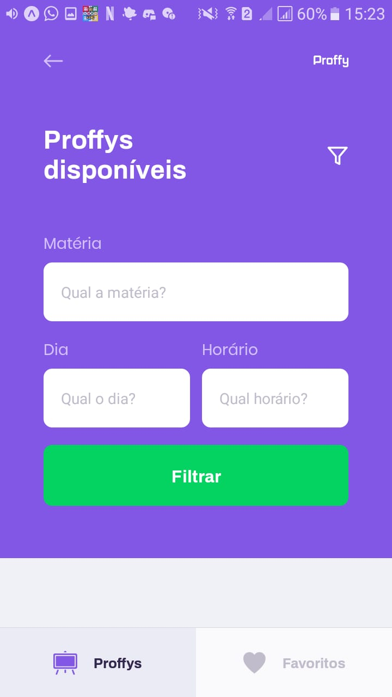

<h1 align="center">
    
</h1>

<p align="center"> 
  O Proffy é uma plataforma que visa facilitar a conexão entre alunos e professores,
  dando a possibilidade dos professores cadastrarem suas aulas especificando a matéria,
  horários, dias... Os alunos podem pesquisar as aulas e entrar em contato com os professores
  facilmente. 
  <br>
  Você pode testar a aplicação em: https://stupefied-turing-6a35f2.netlify.app
</p>

## :computer: Aplicação Web

### Landing 

<p align="center">
    
</p>

### Dar Aulas 

<p align="center">
    
</p>

### Estudar 

<p align="center">
    
</p>

## :iphone: Aplicação Mobile

  <table>
    <tr>
      <th width="50%">
        Landing
      </th>
      <th width="50%">
        Dar Aula
      </th>
    </tr>
    <tr>
      <td>
          
      </td>
      <td>
      
    </td>
    </tr>
  </table>

<table>
  <tr>
    <th width="33.3%">
      Estudar (Filtros)
    </th>
    <th width="33.3%">
      Estudar (Lista)
    </th>
    <th width="33.3%">
      Estudar (Favoritos)
    </th>
  </tr>
  <tr>
    <td>
      
    </td>
    <td>
        
    </td>
    <td>
        
    </td>
  </tr>
</table>

## :bulb: Funcionalidades

* Criar Aulas;

* Listar as aulas com filtro;

* Criar conexões.

## :wrench: Pré-requisitos

 Antes de começar, você vai precisar ter instalado em sua máquina as seguintes ferramentas:
[Git](https://git-scm.com), [Node.js](https://nodejs.org/en/). 
Além disto é bom ter um editor para trabalhar com o código como o [VSCode](https://code.visualstudio.com/)

## :rocket: Para rodar a aplicação

  ```bash

# Clone este repositório
$ git clone https://github.com/Joaobru/Proffy.git

# Acesse a pasta do projeto no seu terminal/cmd
$ cd Proffy-master

# Execute o comando nas pastas server/web/mobile para instalar todas as dependências
$ npm install ou yarn

# Execute a aplicação em modo de desenvolvimento, é importante executar este
# comando primeiro no server depois no web ou mobile
$ npm start ou yarn start

# A aplicação será aberta na porta:3000 - acesse http://localhost:3000

# # Exclusivamente para rodar a aplicação mobile é preciso instalar o Expo 
# no seu celular, quando você rodar a aplicação Mobile com o comando yarn
# start, o seu navegador irá abrir mostrando um QrCode, abra o Expo no seu
# celular, e clique na opção "Scan QR Code", aponte a câmera para o QrCode
# e aproveite para fazer testes no Proffy

```

## 🛠 Tecnologias

  * [Node.js](https://nodejs.org/en/) (Back-End);

  * [ReactJS](https://reactjs.org/) (Web Front-End);

  * [React-Native](https://reactnative.dev/) (Mobile Front-End);

  * [SQLite](https://www.sqlite.org/index.html) (Banco de Dados);


